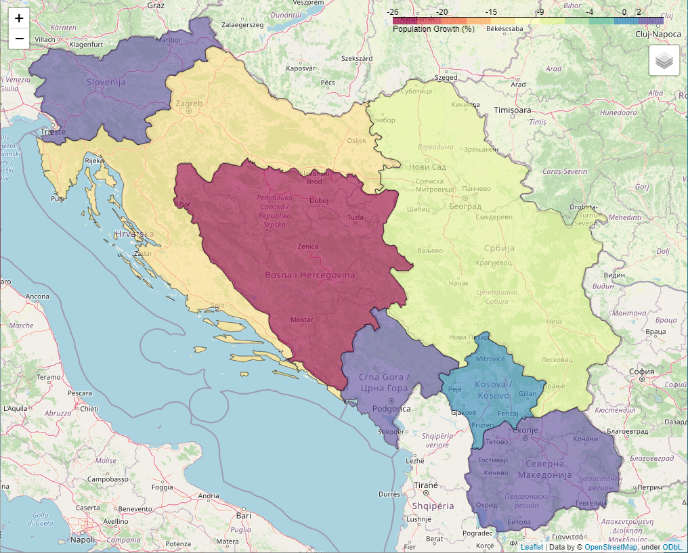

# Population Trend Croatia 1995 - 2018

- [Presentation (slide-deck)](https://github.com/zunicd/Population-Trend-Croatia/blob/master/Croatia_Population_Trend_1995-2014.pdf)
- [Tableau Version](https://public.tableau.com/profile/damir.zunic#!/vizhome/CroatiaPopulationTrend1990-2018/TheStory)
- http://bit.ly/Croatia-Population-Trends - Use this link to get properly rendered notebook. Due to issues with rendering IFrame in GitHub, I have to use nbviewer and then short bitly links.

##### Jupyter Notebooks:

- ***Transforming World Development Indicators.ipynb*** - used to transform the raw file, _WDIData.csv_, from downloaded archive (_WDIcsv.zip_) to the version that facilitate analytics. Its output, _WDI_Indicators.csv_, is the input to the main notebook (_Croatia - Population Trend 1990 - 2018.ipynb_) 
- ***Croatia - Population Trend 1990 - 2018.ipynb)*** - exploratory data analysis (EDA) notebook

### Objective

Being myself an emigrant from Croatia, I am interested in Croatian migration trends in last few decades. As one of ex-Yugoslav republics, in the last 30 years Croatia faced three events that could have an impact to its population:

1. Yugoslav wars (1991 – 1995), led to the breakup of Yugoslavia
2. Great Recession (2008), with follow-up recessions shaking Croatia until 2014
3. Integration to the EU (2013), Croatians acquired right to move and reside freely in other EU member states

This research is very personal to me. In addition to me emigrating (event #1) in 1995, my younger nephew emigrated in 2018 (event #3). So, let’s start crunching the data.

### Summary

Due to issues with rendering IFrame in Jupyter Notebook  in GitHub, I will display the Choropleth map here.  Two countries with the highest population decline: **Bosnia and Herzegovina** (-25.53%) and **Croatia** (-14.40%)

- The Yugoslav wars heavily impacted population of Croatia for almost a decade
- The Great Recession had a smaller but still significant impact that lasted for many years
- I believe from experience that joining EU caused continuous population decline. A significant number of young people is leaving Croatia every year.
- There is no direct relationship between GDP and population decline.
- Croatia GDP per Capita is steadily increasing since 2014 but GDP per Capita in many EU countries is 4 - 5 times higher than in Croatia. This, combined with right to move and reside freely throughout the EU, is probably the main reason for population decline in the last decade.

### Tools / Techniques Used:

- Python

- Pandas

- Matplotlib

- Jupyter Notebook

- Folium

- geoJSON

- Choropleth maps

### About Data

For this project I used the following datasets:

- World Development Indicators Dataset 
  
  **Data Source:** World Development Indicators, The World Bank
  **File:** The raw file, ***WDIData.csv***, from downloaded archive was slightly transformed to the version that facilitate analytics, resulted in ***WDI_Indicators.csv***
  
  **NOTE:** due to size GitHub size limit, these datasets were not uploaded to GitHub
  
- ***Data/custom_geo_high.json*** - the GeoJSON file for ex-Yugoslavia countries was built on this site: https://geojson-maps.ash.ms/. The country code for Kosovo, XKX, was used to manually update the sov_a3 code in the GeoJSON file.

- ***Data/world-development-indicators/WDI_Indicators-Tableau.csv*** -  this file was created be used in Tableau Public version of this project

 

